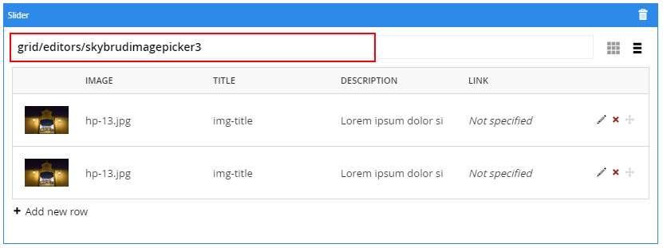
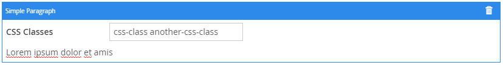

Guidelines
===========

## Código usado
* source code do Umbraco CMS (compilação de backend + frontend) (https://github.com/umbraco/Umbraco-CMS, dev-v7, with Commits on Apr 18, 2017)

* adicionado à solução o source code do proj "YouTube Umbraco" (https://github.com/warrenbuckley/YouTube-Umbraco.git) + inclusão (manual) dos ficheiros frontend no proj "Umbraco.Web.UI" (Umbraco.Web.UI\App_Plugins\YouTube\*)

## Packages
* adicionado ao proj "Umbraco.Web.UI" (via nuget) os Umbraco package "Skybrud.ImagePicker" e "Skybrud.LinkPicker" => DLL's + ficheiros frontend (Umbraco.Web.UI\App_Plugins\Skybrud.*\*)

**(COM PROBLEMAS, AINDA NAO FUNCIONA)** - adicionado ao proj "Umbraco.Web.UI" (via nuget) o Umbraco package "Umbraco LeBlender" 1.0.8.4


### **para validar** ###
* (ainda não foi adicionado como previsto, talvez não vá ser usado)- adicionado ao proj "Umbraco.Web.UI" (via nuget) o Umbraco package "Our.Umbraco.NestedContent" 0.4.0
---

Alterações ao Source Code Umbraco
===========
(nada para já)

---

Devs
===========
* Instalação do website tem o **Models Builder** configurado para **_LiveDll_** (namespace Umbraco.Web.PublishedContentModels)
* Templates de teste DocModel e DocModelAlt são usados com o DocType "DocModel" e estão tipificados para `ContentModels.DocModel` 
```
@inherits UmbracoViewPage<ContentModels.DocModel>
@using ContentModels = Umbraco.Web.PublishedContentModels;
```
* Template DocModel usa grid nativa de Umbraco para renderizar
``@Html.GetGridHtml(Model, "grid")``

* Template DocModelAlt usa uma custom grid para renderizar
``@Html.GetGridHtml(Model, "grid", "CustomGrid")``

* Custom Grid Editors (`App_Plugins/CustomGridEditors/*`)
    1. SkybrudImagePicker
    ```json
    { //depends on 'Skybrud.ImagePicker' package
      "name": "Slider",
      "alias": "Skybrud.ImagePicker.GridEditor",
      "view": "/App_Plugins/Skybrud.ImagePicker/Views/ImagePickerGridEditor.html",
      "render": "SkybrudImagePicker",
      "icon": "icon-pictures-alt-2",
      "config": {
        "title": {
          "show": true,
          "placeholder": "partial view to use when rendering the content"
        }
      }
    }
    ```
    Este grid editor usa a partial view `Views/Partials/Grid/Editors/SkybrudImagePicker.cshtml` que é responsável por fazer parsing do valor JSON da propriedade para o tipo `Skybrud.ImagePicker.ImagePickerList` e, caso exista uma partial configurada no editor da grid (neste momento usa a propriedade 'Title' do SkybrudImagePicker), carrega uma partial view específica
    ```csharp
    ///excerpt of partial view 'SkybrudImagePicker.cshtml'
    if (!string.IsNullOrWhiteSpace(imagePickerList.Title))
    {
        <text>@Html.Partial(imagePickerList.Title, imagePickerList)</text>
    }
    ```
    
.

2.  Simple Paragraph
    ```json
    {
      "name": "Simple Paragraph",
      "alias": "paragraph",
      "view": "/App_Plugins/CustomGridEditors/Paragraph/Views/Editor.html",
      "render": "/App_Plugins/CustomGridEditors/Paragraph/Views/Render.cshtml",
      "icon": "icon-keyboard"
    }
    ```
    Este grid editor permite especificar css classes para serem considerados na renderização da propriedade
    
    
    